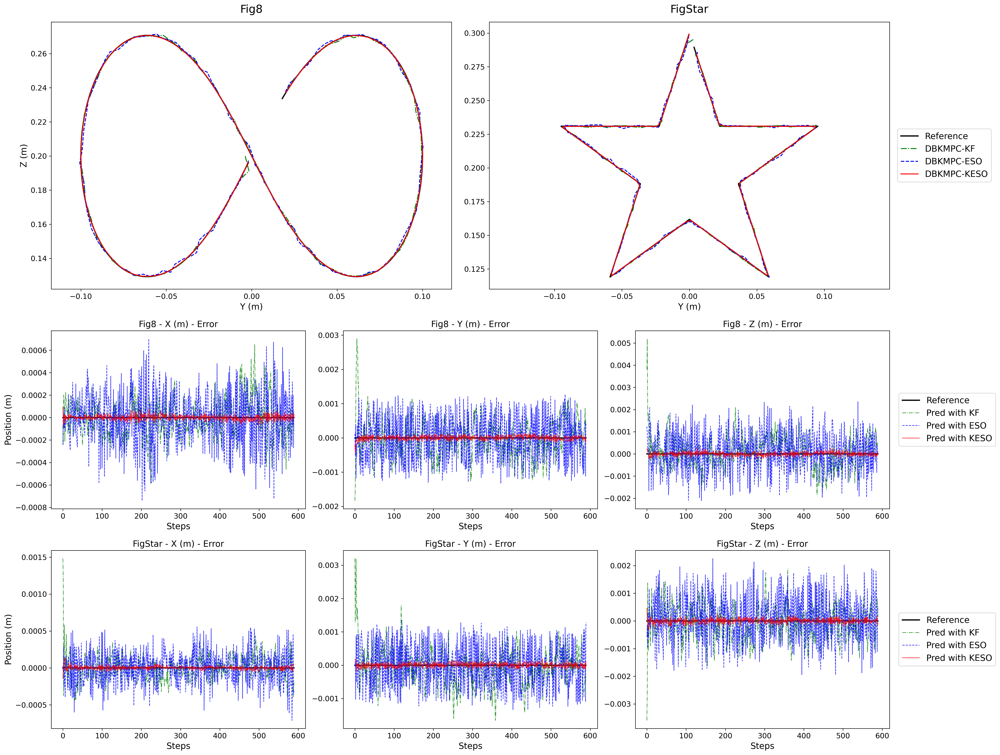
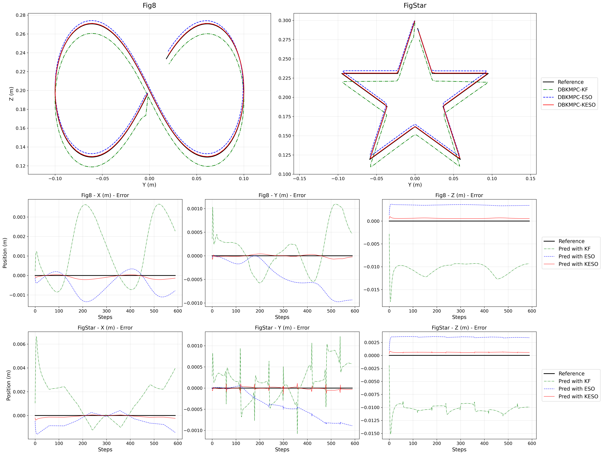
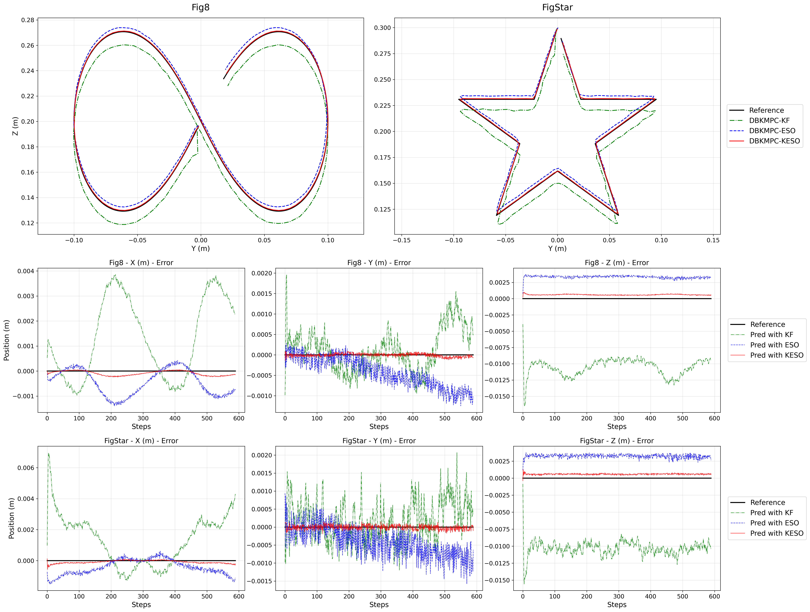

# SO-ARM101 Koopman Sim2Real

基于 Koopman 算子理论的 SO-ARM101 六自由度机械臂仿真到真机迁移 (Sim2Real) 项目，实现数据驱动的动力学建模、预测与 MPC 控制。

## ✨ 特性

- 🤖 支持多种 Koopman 网络架构（DKUC、DBKN、IKN、IBKN、Koopformer、KANKoopman）
- 🎮 基于 MuJoCo 的高保真物理仿真环境
- 🎯 CasADi 实现的 MPC 控制器
- 🔄 ZMQ 实现的 Sim2Real 实时通信
- 📊 完整的训练、评估与可视化流程

## 📁 项目结构

```
├── SOARM101/                 # MuJoCo 仿真环境
│   ├── SOARM101_Env.py       # Gymnasium 风格环境封装
│   ├── SOARM101_DataCollection.py  # 数据采集脚本
│   └── SO101/                # 机器人 URDF/XML 模型
├── models/                   # Koopman 网络实现
│   ├── base_model.py         # KoopmanNet 基类
│   ├── KoopmanBase.py        # DKUC/DBKN 线性/双线性模型
│   ├── InvertKoopman.py      # IKN/IBKN 可逆网络模型
│   └── losses.py             # 损失函数定义
├── control/                  # MPC 控制模块
│   ├── MPC_Controler.py      # MPC 控制器实现
│   ├── TrajectoryGenerator.py # 轨迹生成器
│   └── config.py             # 实验配置管理
├── lerobot_sim2real/         # Sim2Real 通信模块
│   ├── so101_mujoco.py       # MuJoCo 端 ZMQ 发布者
│   └── so101_real.py         # 真机端 ZMQ 订阅者
├── args.py                   # 命令行参数配置
└── train.py                  # 训练/测试入口
```

## 🚀 快速开始

### 安装依赖

```bash
pip install -r requirements.txt
```

### 训练模型

```bash
# 训练 DBKN 模型
python train.py --model DBKN --mode train 

# 训练可逆 Koopman 网络
python train.py --model IBKN --mode train 

```

## 🧪 主要实验

本项目重点验证了两种抗干扰控制架构：

### 1. IBKN + UKF (基于可逆 Koopman 的 UKF 状态估计)

结合 **可逆双线性 Koopman 网络 (IBKN)** 与 **无迹卡尔曼滤波 (UKF)**，解决模型不确定性与观测噪声问题。

- **运行命令**:

```bash
  # 需手动进行对照实验 
  python IBKN_UKF.py
```

- **实验结果**: 

### 2. DBKN + KESO (基于深度双线性 Koopman 的扩张状态观测器)

利用 **深度双线性 Koopman (DBKN)** 结合 **Koopman 扩张状态观测器 (KESO)**，对未建模扰动进行实时估计与补偿。

- **运行命令**:

```bash
  # 需手动进行对照实验
  python DBKN_KESO.py
```

- **抗噪声实验结果**: 
- **抗负载实验结果**: 
- **抗噪+抗负载实验结果**: 

## 🧪 Sim2Real 部署


